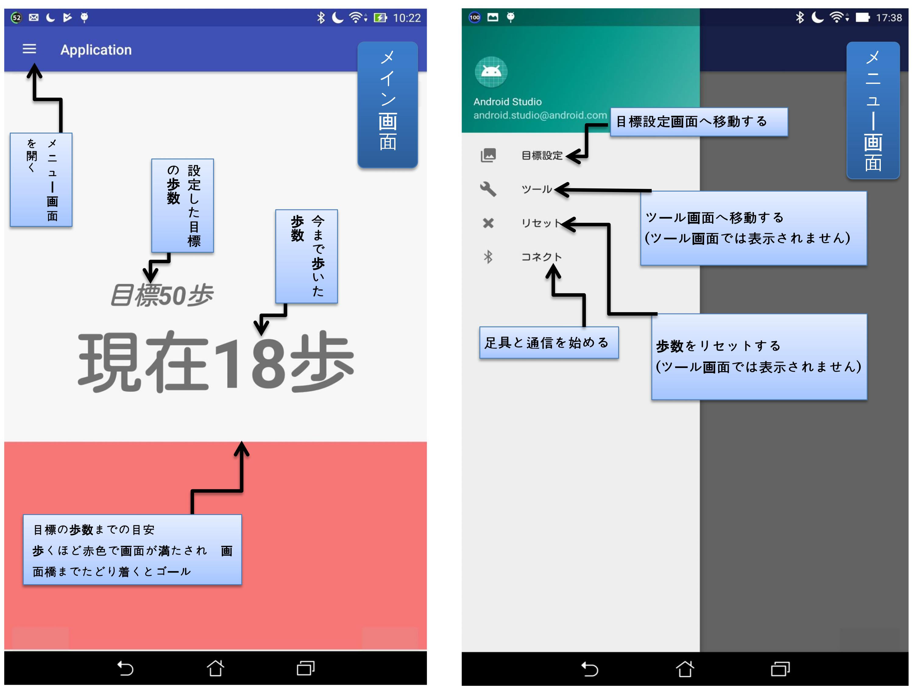
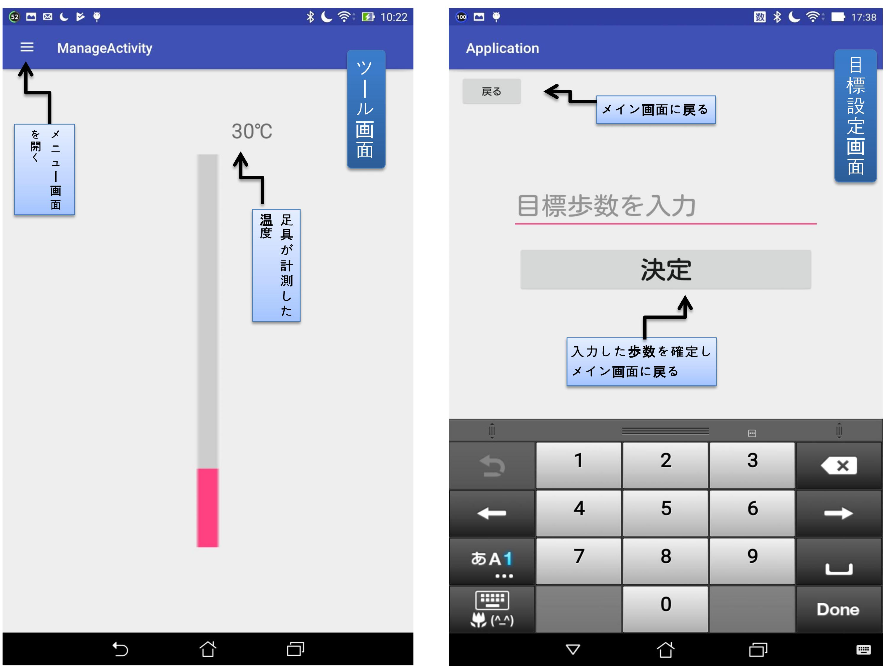

# 始めに

このフォルダをダウンロードした後、androidsutudioをインストールし。

一つプロジェクトを作成した後、AndroidStudioProjects（初期設定の場合　C:\Users\__username__\AndroidStudioProjects になる）内にフォルダを移動する。

androidsutudioを起動し、fileからopenを選び、移動したフォルダを選択しOKを押すことでプログラムを開くことができる

## 基本的な参考サイト

* androidstudioのインストール方法　https://akira-watson.com/android/adt-windows.html

* ドットインストール等開発参考サイトまとめ（旧バージョンに注意）　https://qiita.com/morizyun/items/ec78167ba1b66f4dad6d

* デバッグのためにNOXとandroidstudioを接続する方法　https://www.bignox.com/blog/how-to-connect-android-studio-with-nox-app-player-for-android-development-and-debug/

### 開発環境

  androidsutudio3.0
  
  デバッグ用タブレットandroidVer4.4

### アプリの動作説明

    
